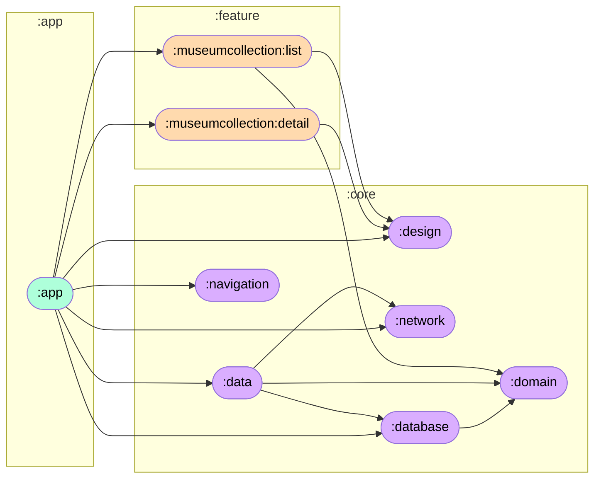

# Happtech

[](https://github.com/mcgalanes/happtech/actions/workflows/ci.yml)

# Setup

#### Requirement
- Java 22
  
#### Install app
```
./gradlew installDebug
```

#### Run Unit Tests
```
./gradlew testDebugUnitTest
```

# Features
- Search
- Art Object Listing (Offline)
- Art Object Detail
- Landscape / Portrait


# Architecture & Patterns


- Jetpack Compose
- Multi modules
- Clean Architecture
- MVVM (Model-View-ViewModel)
- Repository Pattern
   - Remote (Ktor)
   - Local (Room)   
- Dependency Injection (Koin)
- Gradle Convention Plugins
